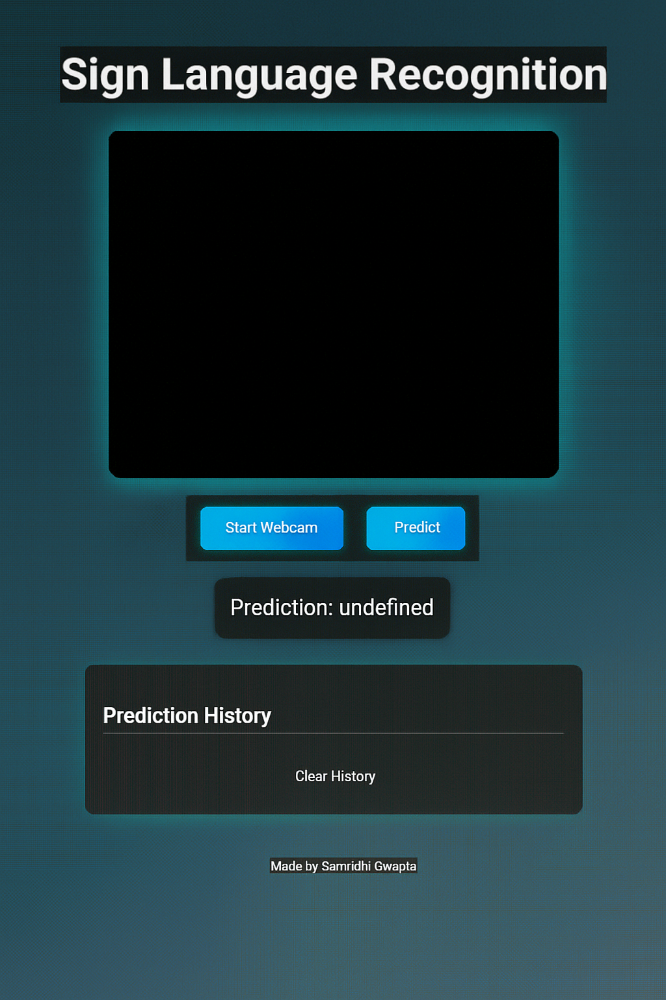

# 🤟 Sign Language Recognition Web App

[]
[]
[]
[]

An **AI-powered**, **front-end-rich** web app that captures live webcam input to recognize sign language in real time—now with enhanced color themes, smooth animations, and an interactive UI experience.

---

## 🎨 Live Preview



---

## 🚀 Features

- **🔴 Real-time webcam stream** directly in the browser
- **🎯 Gesture predictions** powered by a trained ML model via Flask
- **✨ Animated UI** with gradient buttons, hover effects, loading spinner
- **📜 Live prediction history** with scrollable, interactive entries
- **🗑️ Clear history button** with trash icon
- **📱 Fully responsive** design—works beautifully on mobile devices
- **🌐 Auto-launch browser** when server starts automatically

---

## 🛠️ Tech Stack

| Layer          | Technologies |
|----------------|--------------|
| **Frontend**   | HTML, CSS (gradients & animations), JavaScript, Font Awesome |
| **Backend**    | Python, Flask, OpenCV |
| **AI Model**   | TensorFlow/Keras (+ .h5 format) |
| **UI Styling** | Responsive design, gradient themes, loader & onboarding animations |

---

## ⚙️ Set Up & Run

```bash
git clone https://github.com/SamridhiiiGupta/Sign-Language-Recognition-Web-App.git
cd Sign-Language-Recognition-Web-App
pip install -r requirements.txt
python app.py
````

✔️ Browser opens automatically at `http://127.0.0.1:5000`

---

## 📁 Directory Structure

```
├── model/              # Trained ML model (sign_language_model.h5)
├── static/             # (Optional) CSS / JS / images
├── templates/          # index.html
├── app.py              # Flask server + browser launcher
├── requirements.txt    # Dependencies
├── README.md           # This file
└── LICENSE             # MIT License
```

---

## 🎬 Workflow

1. **Launch App** → Browser opens
2. **Start Webcam** to activate video stream
3. Click **Predict** → Show loader → Receive prediction
4. Prediction shown on UI + added to history list
5. Click **Clear History** to reset the list

---

## 🌱 Future Enhancements

* Add **text-to-speech** for each predicted gesture
* Offer **light/dark theme toggle**
* Enable **uploading custom images** alongside webcam input
* Deploy on cloud platforms (Heroku, AWS, Render)
* Expand to **sentence-level recognition**

---

## 👩‍💻 Contributor

**Samridhi Gupta**

* 🖥️ Frontend UI & UX design
* 🧠 Flask backend & integration
* 🔄 ML model creation & deployment pipeline

📩 Contact: [guptasamridhi1432@gmail.com](mailto:guptasamridhi1432@gmail.com)
🧬 LinkedIn: [https://www.linkedin.com/in/samridhi-gupta](https://www.linkedin.com/in/samridhi-gupta)

---

## 📄 License

Distributed under the [MIT License](LICENSE).
*Open for contributions and suggestions!*

---

> “Bridging communication with color, animation, and AI.”